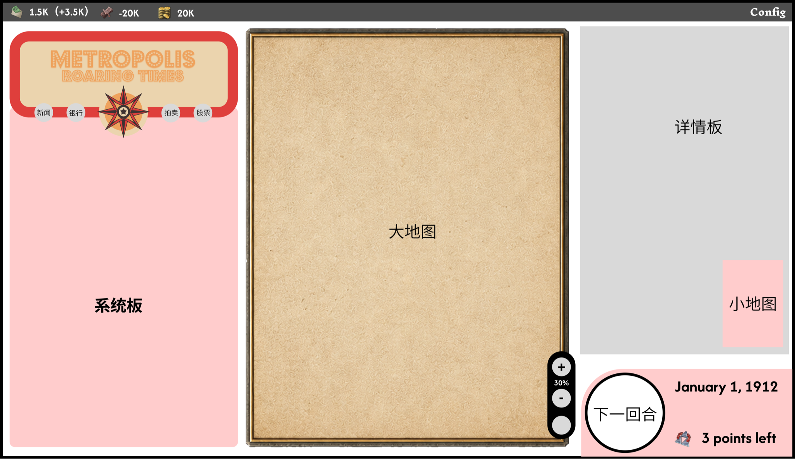
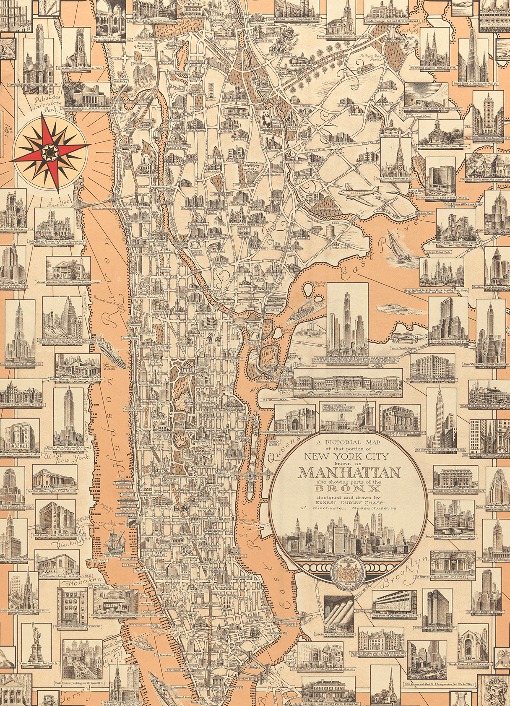
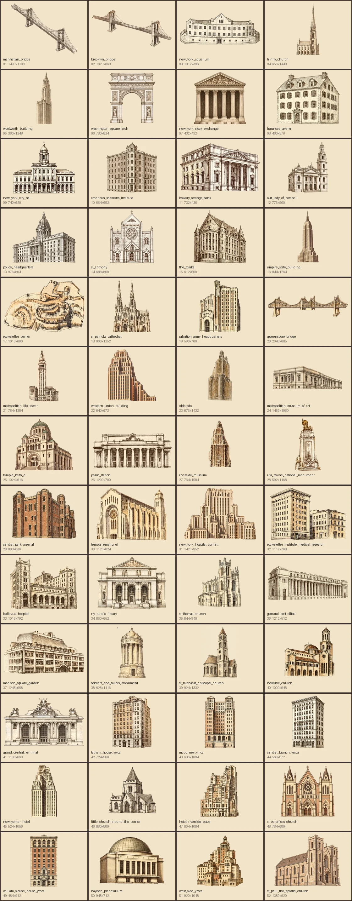
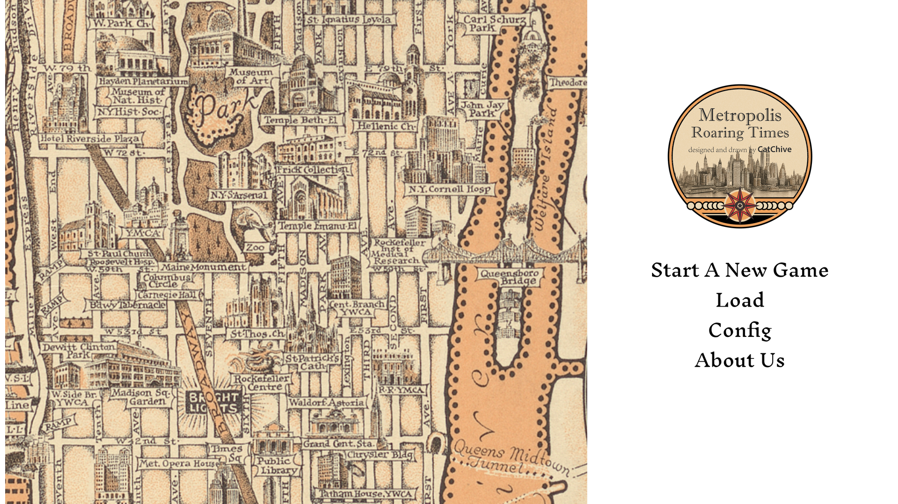
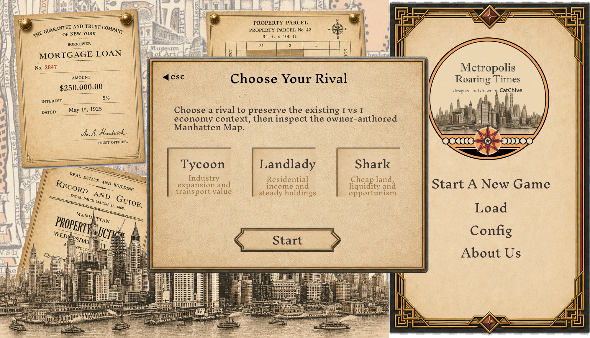

<p align="center">
  
</p>

<h1 align="center">Metropolis: Roaring Times</h1>
<h2 align="center">大都会：咆哮时代</h2>

<p align="center">
  <b>历史策略</b> · <b>地产经营</b> · <b>回合制经济模拟</b> · <b>Vibe Coding</b>
</p>

<p align="center">
  <a href="https://shooyuan.github.io/metropolis-roaring-times/"><b>在线试玩 Live Demo</b></a>
</p>



## 项目简介

**《大都会：咆哮时代》** 是一款以 20 世纪初纽约曼哈顿为背景的单人回合制地产策略游戏原型。玩家扮演一名地产经营者，在 30 回合内购买土地、建设公寓 / 工厂 / 百货公司，管理现金与债务，并在经济周期、分区法令、金融市场和竞争对手行动中争取更高净资产。

这是我用于求职实习的个人作品集项目。相比只做一个静态页面，我希望它能展示我如何把一个历史题材创意推进成可玩的系统：从地图交互、经济循环、UI 风格、素材管理、双语文本，到 GitHub Pages 在线部署。

## 面试官可以重点看什么

| 能力方向 | 项目中的体现 |
|---|---|
| 产品与系统思维 | 将“1920s 曼哈顿地产竞争”拆解为回合、行动点、现金流、债务、地价、建筑收益和证券市场 |
| 前端实现能力 | 使用原生 HTML / CSS / JavaScript 完成可部署的浏览器游戏原型 |
| 游戏交互设计 | 支持地图拖拽、缩放、街区 / 地块 / 历史地标互斥选择和详情面板 |
| UI 视觉迭代 | 以旧地图、地产档案、证券票据和 Art Deco 气质为方向设计界面 |
| 内容组织能力 | 整理 12 个街区、30 个可购地块、52 个历史地标及双语展示结构 |
| 工程习惯 | 包含静态测试、资源清单、README、GitHub Pages 自动部署和仓库整理 |

## 游戏内容

| 模块 | 当前原型内容 |
|---|---|
| 地图 | 12 个曼哈顿街区、30 个可购买地块、52 个历史地标 |
| 经营 | 购买土地、建造建筑、改建升级、经纪出售 |
| 经济 | 30 回合经济节奏、现金、债务、收入、地价变化 |
| 金融 | 银行借款、还款、证券买卖 |
| 对手 | 3 种 AI 对手风格原型 |
| 文本 | 英文 / 简体中文界面切换 |
| 部署 | GitHub Pages 在线试玩 |

## 视觉与内容展示

| 曼哈顿地图与 UI 方向 | 历史地标素材 |
|---|---|
|  |  |

| 建筑与地块呈现 | 角色 / 弹窗 UI 参考 |
|---|---|
|  |  |

## 我负责的工作

- 设计并实现网页端可玩原型，而不是只停留在概念文档。
- 建立地图运行数据，让街区、地块和地标可以在浏览器中交互。
- 实现基础经济系统：行动点、现金、收入、债务、贷款、证券、AI 对手和结算回合。
- 处理 UI 迭代问题，例如按钮尺寸、状态栏拥挤、地块选中框、历史地标详情可读性和地图操作卡顿。
- 建立中英文文本结构，并让同一套页面支持语言切换。
- 整理仓库结构，配置 GitHub Pages，使项目可以直接在线体验。

## 技术栈

- HTML / CSS / JavaScript
- SVG / JSON runtime map data
- Browser localStorage save data
- Node.js static checks
- GitHub Actions + GitHub Pages

## 本地运行

```bash
python3 -m http.server 4173 --bind 127.0.0.1 --directory m0_web
```

然后打开：

```text
http://127.0.0.1:4173/
```

macOS 也可以直接双击：

```text
run_metropolis_demo.command
```

## 测试

在 `m0_web/` 目录下运行：

```bash
node tests/m1w_static_test.js
node tests/m1w_i18n_static_test.js
node tests/map_content_contract_test.js
node tests/runtime_map_integration_test.js
```

## 当前状态与后续计划

当前版本是一个可在线游玩的浏览器原型。Godot 工程文件保留在仓库中，作为后续正式游戏化的准备；目前主要展示的是玩法验证、系统原型、界面方向和工程组织能力。

后续我希望继续完善：

- 更完整的 AI 决策逻辑
- 更清晰的经济平衡曲线
- 拍卖、新闻事件和政策变化系统
- 更接近最终游戏的 UI 布局与动效
- Godot 版本的长期迁移

## 一句话总结

这个项目不是一个“只会展示的网页”，而是我尝试把历史题材、策略系统、界面审美和前端工程结合起来的一次完整原型实践。
